# Asset audit — September 29, 2026

The approved equipment set is implemented: six item families in white, green,
blue, purple and orange, including the new layered Armor Core and circular Power
Core with the slim layered rim. The rest of the application still has visual
gaps. The next most valuable work is the launch/app identity and level picker,
then damage overlays, doors and vendor presentation.

## Delivered equipment

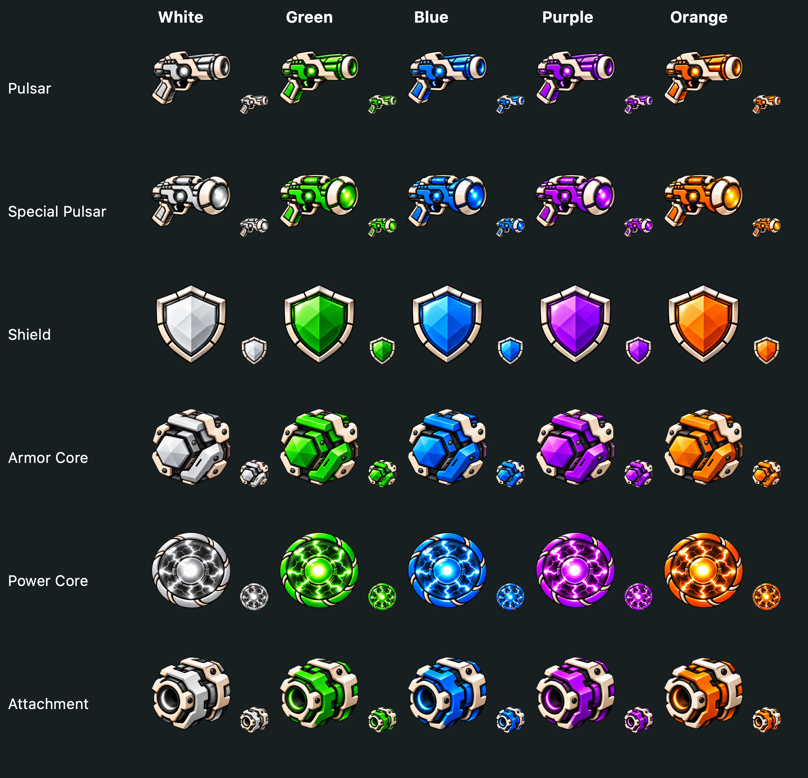

These are rendered by the application, not the approval mockup. All thirty
designs are stored in six transparent atlases in `Cubrism/Assets.xcassets/StyleA`.
Each is 1536 × 1024, three columns by two rows: white, green, blue, purple,
orange, empty. The previous six-green-item sheet and color-marker overlay are
removed. Original saved item identifiers, stats, drop rules and rarity tiers
are unchanged.

Common equipment uses the unnumbered white icon. Higher-tier equipment uses its
saved cosmetic variant: suffix 0 = green, 1 = blue, 2 = purple, 3 = orange.
Cosmetic color and rarity are separate existing concepts. `GameArt.imageName(for:)`
now applies that same rule to inventory, equipped slots, shop and rewards; the
reward page previously discarded the saved color variant.

Artwork is fitted proportionally into its existing logical size, with a small
gutter for the rarity frame. Rendered item images retain at least 288 pixels per
side for enlarged detail views without changing SpriteKit sizes or physics.
The original ammunition artwork is deliberately retained.

Built-in image generation was used for the production cutouts. Exact prompts,
source filenames and production paths are recorded in
[equipment-art-sources.json](equipment-art-sources.json). The approved contact
sheet is [retained here](art/approved-equipment.png).

## Coverage

- Inspected all **135 image sets / 385 referenced image files** in the active
  asset catalog, including generated sources and legacy resources; all referenced
  files exist. Full dimensions, scale tags, modes and file sizes are in
  [asset-inventory.json](asset-inventory.json).
- Traced static and dynamic image names through `GameArt`, item nodes, reward
  rows, enemy/boss components, doors, world surfaces and UI controls.
- Rendered all item colors, player, nine enemy types, boss art, thirteen boss
  animation frames, eighteen projectile/effect images, three damage overlays,
  doors, currency, HUD assets and five world surface sets.
- Inspected the launch storyboard and active app-icon catalog separately: these
  bypass `GameArt`. The three Comfortaa font files are present. The old
  `HomeScene.sks`, Photoshop sources and standalone `Cubrism/AppIcon.appiconset`
  are archival/unused by the current programmatic scene and active asset catalog.
- Reviewed actual bank/shop node renders and reward/level-picker layout renders
  at phone and desktop sizes. This is an asset and rendering audit; it does not
  claim a fresh playthrough of every world or physical-device input testing.

## Recommended next updates

| Priority | Area | Current evidence | Recommended change |
|---|---|---|---|
| High | Launch screen and app icon | Launch storyboard directly loads the old blue `loadingScreen`, so the runtime replacement never appears at launch. Fixed legacy launch geometry also stretches the illustration. App icons show the original shaded squares; the active catalog has no 1024px marketing or Mac-specific slots. | A clean Stone & Enamel identity using the approved player/gun, a responsive launch layout, and complete iOS/Mac icon exports. |
| High | Level selection | The functional picker is still plain dark cards with text/emoji status. The illustrated arena/world-preview proposal has not been implemented. The old `backgroundNCell` assets are not used by `LevelCell`. | Implement the illustrated picker direction, five distinct world previews, and coherent selected/cleared/locked states. Use clear icons instead of emoji. |
| High | Damage overlays | `damaged25/50/75` are still the original 32/64/96px pale pixelated cracks over the new enamel enemies. | Three crisp transparent crack/chip stages following the new square bevels; keep damage thresholds intact and avoid hiding enemy-type symbols. |
| High | Boss-door states | Locked and unlocked boss-door textures both resolve to the same red diamond. Normal doors distinguish their lock states. | Give the boss door a distinct open state and lock indicator. Retain the boss emblem but make access readable independently of color. |
| Medium | Doors, teleporter, bank and merchant | In-world objects are flat SF Symbol cards. The portal reuses an ordinary arrow door; the merchant and bank look like UI buttons. | Dedicated dimensional door frames, an unmistakable portal, and compact vending/bank machinery in enamel and stone. Preserve collision bounds. |
| Medium | Inventory/shop surfaces and rarity frames | New items work, but the panels have thin broken-looking dividers, small slots, a dominant player illustration and little slot labeling. Rarity frames are unrelated to item color: white common gear currently has a green frame. | Separate rarity from cosmetic color visibly (tier pips or labels), consistent slot frames/selection, clearer equipment-slot names and less competing decoration. This is presentation work, not a change to rarity/drop math. |
| Medium | Currency | `Cubrixel` is a flat SF cube in a dark card beside richer equipment. | An illustrated gold cube with the same lighting/bevel language. Keep its silhouette distinct from equipment and do not recolor it by rarity. |
| Delivered | Arena backgrounds | The approved ten-background set now follows local levels 1–10 across all five worlds, including revised Cargo Hold and Molten Forge last. All rooms use the same fixed gameplay bounds. | Future polish can add matching illustrated doors and level-picker thumbnails. |
| Lower | Boss attack animation and golem blocks | Boss base art is approved. Dragon mouth frames are a split/offset of one image; golem frames squash one image. `golemBlock` is a plain brass panel. | Retain boss designs; add real mouth-opening/jump anticipation frames and a matching stone block when animation polish is scheduled. |
| Lower | Pause/death/completion finish | Theme colors and completion layout are updated, but these screens still mostly use simple panels and native progress bars. | Shared panel corners, button states, reward-row treatment and spacing. Keep the approved stacked HUD and left-side icons. |

### Evidence

Original launch and app identity:

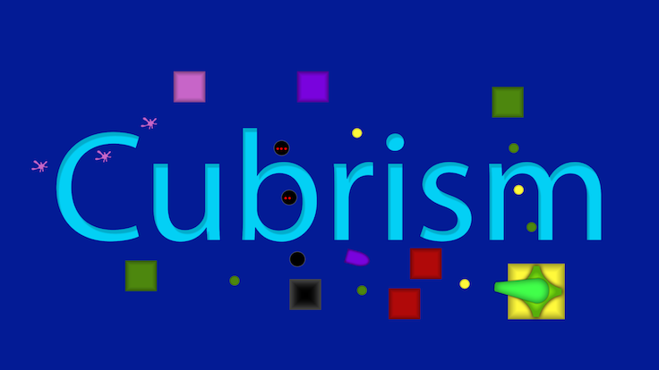
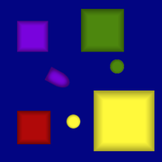

Current level picker:

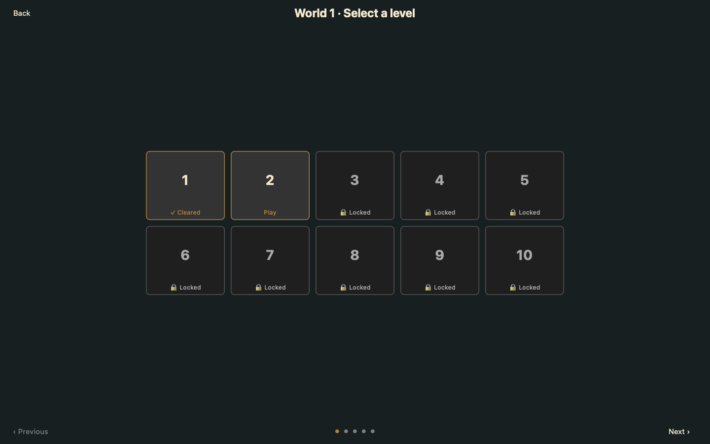

Live interface catalog (note identical boss lock/unlock images):

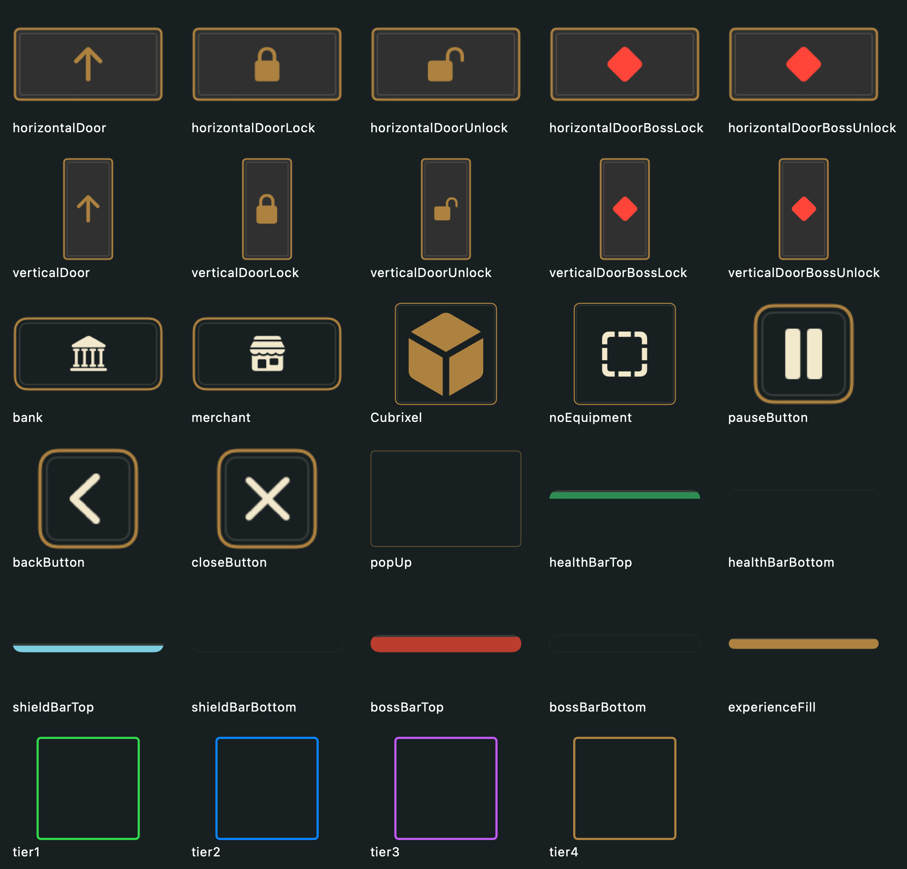

Damage overlays, boss frames and golem block:

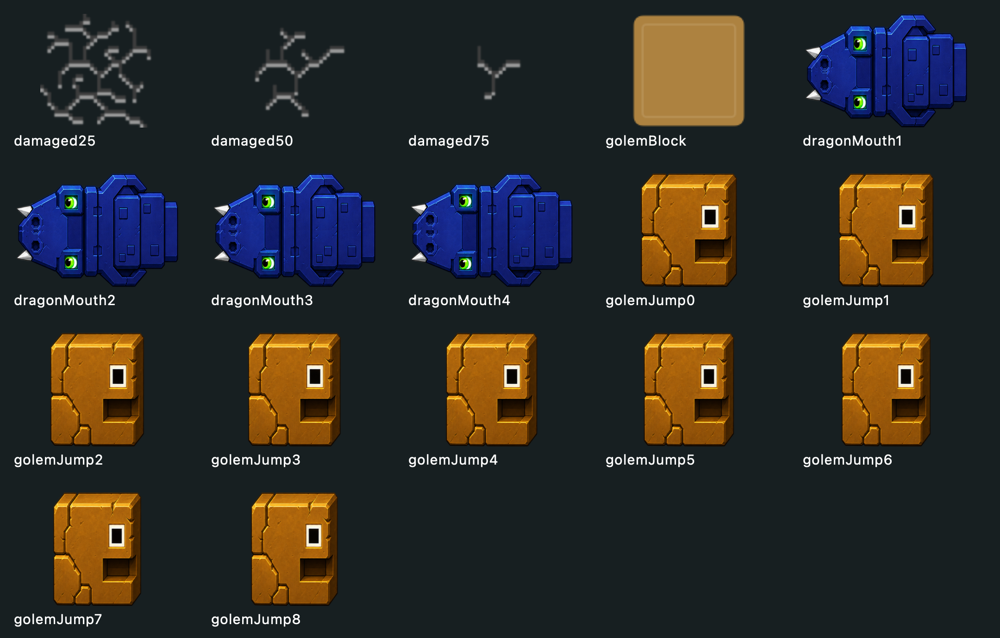

Five world surfaces:

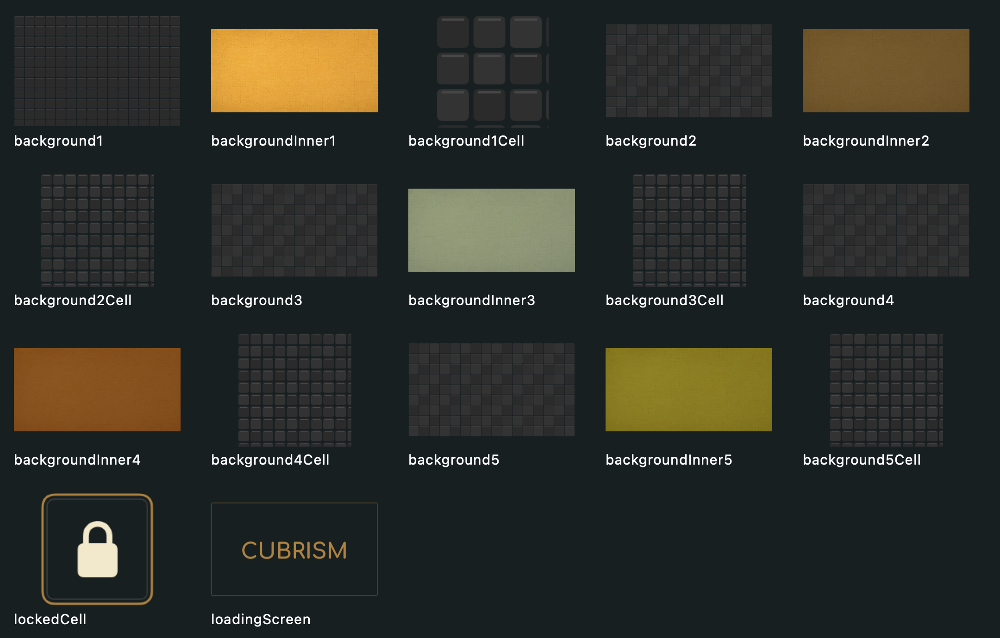

New items in existing inventory and shop panels:

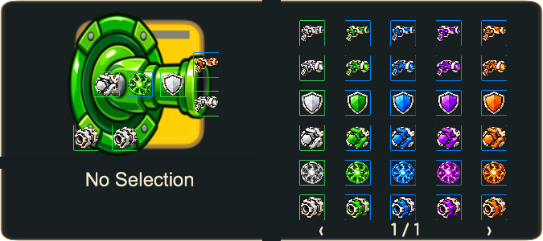
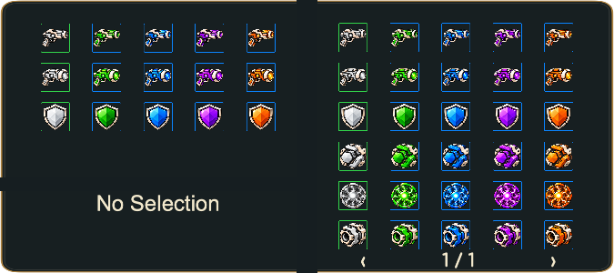

## Keep

- Approved player chassis/gun, enemy and boss base designs.
- Original projectiles, especially the tracking bullet; these remain pixel-for-pixel
  equal to their bundled originals and have regression coverage.
- Approved stacked health/shield design, left icons and no percentages. Fill masks
  retain the bar geometry at 100%, 75%, 50%, 25%, 5% and zero.
- Newly approved equipment silhouettes and all five colorways.

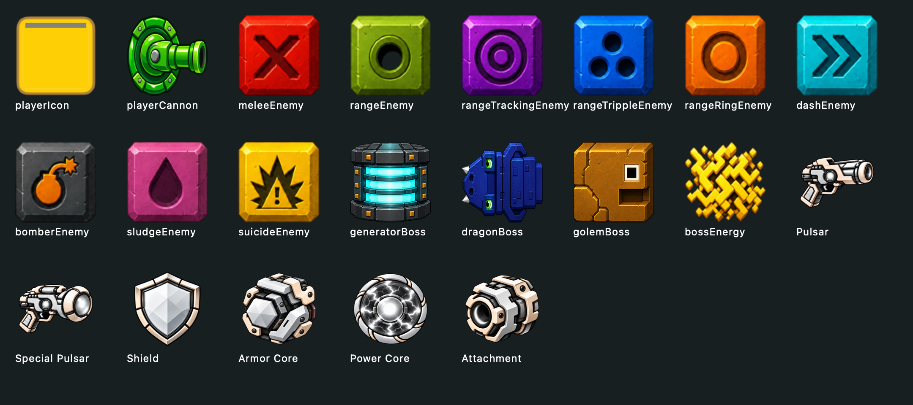
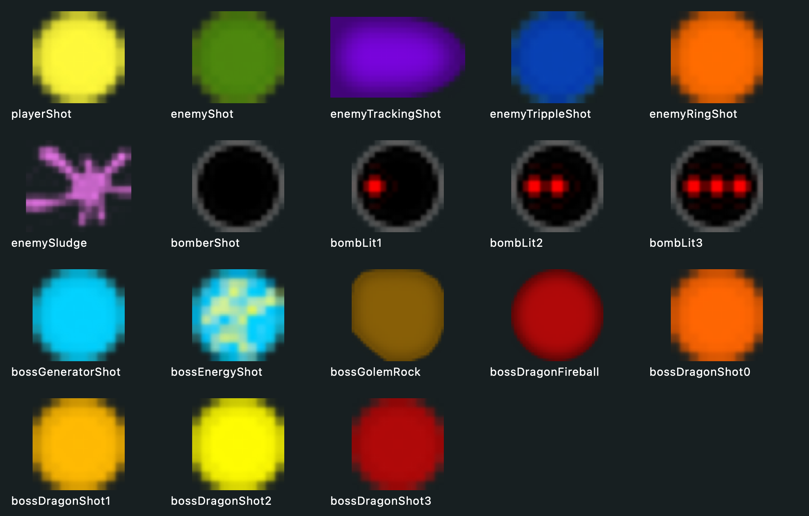
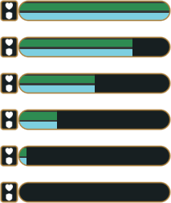

## Technical cleanup to schedule

Forty-nine legacy image sets have inconsistent point dimensions across their
1x/2x/3x entries (including copied 96px originals tagged at every scale). The
catalog currently depends on those legacy images for logical-size lookup even
when replacement art is drawn. Define explicit logical sizes and migrate those
dependencies before removing old files. This would also avoid unnecessarily
large runtime render buffers for old boss/background dimensions. No unmeasured
performance improvement is claimed here.

Legacy backgrounds, old equipment art and duplicate icon/source directories
should only be retired after verifying their remaining size/fallback references.
The obsolete `StyleItems` sheet replaced by this change has been removed; the
other legacy resources remain intact.

## Verification

- Mac Catalyst: 40 checks passed, including all thirty colorways, real alpha,
  crop boundaries, circular cores, proportional guns, cached textures, saved
  variant consistency, reward scrolling/Continue, bank/shop previews and existing
  gameplay/input/reward regressions.
- iPhone 16e simulator (iOS 18.5): the same 40 checks passed.
- An additional focused Mac test confirmed that SpriteKit retains at least
  288 pixels per side for every equipment texture, matching the UIKit images.
- `git diff --check` passed.
- Structured review (`autoreview --mode local --no-web-search`) completed with
  no findings; no findings were accepted or rejected.
- Refreshed `/Users/beep/Applications/Cubrism Style A.app`, verified its ad-hoc
  signature and opened the installed app's shop with the new equipment visible.
- Full test results are saved outside the repository at
  `/Users/beep/codex-work/cubrism-validation/equipment-mac-final.xcresult` and
  `/Users/beep/codex-work/cubrism-validation/equipment-ios-final.xcresult`.
  The structured review is saved alongside them as `equipment-review.json`.
